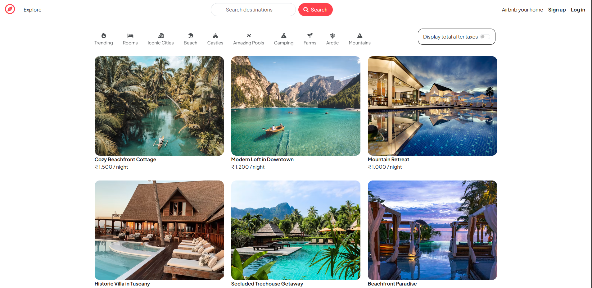
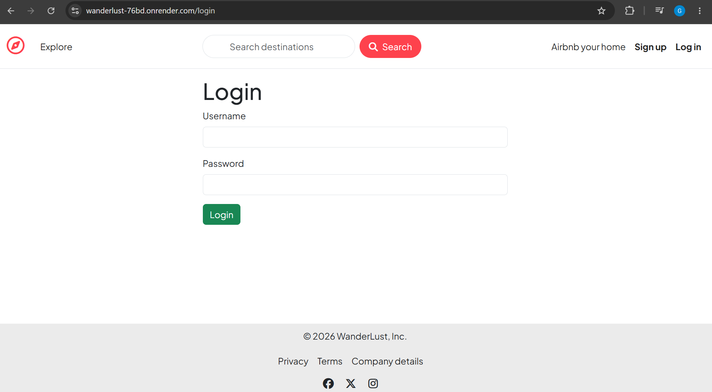
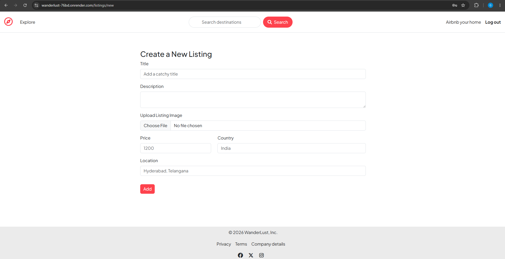
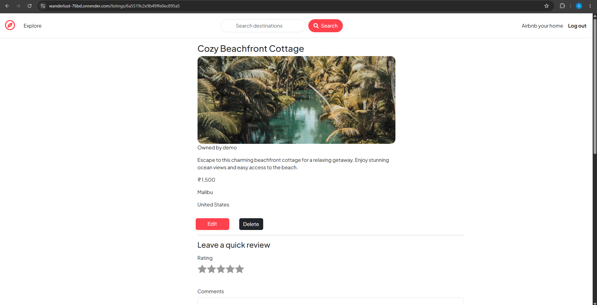
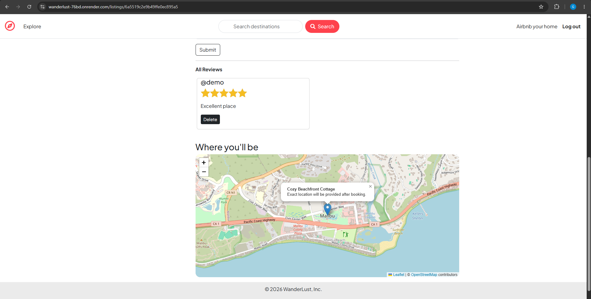

# 🏡 WanderLust

WanderLust is a full-stack vacation rental web application that allows users to discover, create, edit, and manage accommodation listings. Users can securely sign up, upload property images, leave reviews and ratings, and explore listing locations through interactive maps.

🌐 **Live Demo:** [View Live Website](https://wanderlust-76bd.onrender.com)

---

## ✨ Features

- 🔐 Secure User Authentication (Signup, Login & Logout)
- 🏠 Create, Edit and Delete Listings
- ☁️ Image Uploads with Cloudinary
- ⭐ Review & Rating System
- 🗺️ Interactive Maps using Leaflet & OpenStreetMap
- 📍 Location Geocoding using Nominatim
- 💾 MongoDB Atlas Database
- 🍪 Session Management with Connect-Mongo
- 📱 Responsive User Interface using Bootstrap 5

  ---

## 🛠️ Tech Stack

### Frontend
- HTML5
- CSS3
- Bootstrap 5
- JavaScript (ES6)
- EJS (Embedded JavaScript Templates)

### Backend
- Node.js
- Express.js

### Database
- MongoDB Atlas
- Mongoose

### Authentication & Sessions
- Passport.js
- Passport Local
- Express Session
- Connect-Mongo

### Cloud & APIs
- Cloudinary (Image Storage)
- Multer (File Uploads)
- Leaflet.js
- OpenStreetMap
- Nominatim Geocoding API

### Deployment & Version Control
- Render
- Git
- GitHub

  ---

## 📸 Screenshots

### Home Page



---

### Login Page



---

### Create Listing



---

### Listing Details



---

### Listing with Reviews




> 💡 **Don't want to set it up locally? Try the live demo:**  
🌐 **Live Demo:** [View Live Website](https://wanderlust-76bd.onrender.com)

---

## 🚀 Installation

### 1. Clone the repository

```bash
git clone https://github.com/ganesh-chindam/WanderLust.git
```

### 2. Navigate to the project folder

```bash
cd WanderLust
```

### 3. Install dependencies

```bash
npm install
```

### 4. Create a `.env` file

Add the following environment variables:

```env
ATLASDB_URL
SECRET(your_session_secret)
CLOUD_NAME
CLOUD_API_KEY
CLOUD_API_SECRET
```

### 5. Start the application

```bash
node app.js
```

The application will run on:

```
http://localhost:8080
```

---

## 🔮 Future Improvements

- 🔍 Implement functional search for listings.
- 🏷️ Add category-based filtering.
- ❤️ Allow users to save listings to a wishlist.
- 📅 Implement booking and reservation functionality.
- 💳 Integrate secure online payment gateway.
- 📧 Add email verification and password reset.
- 📱 Improve responsiveness for smaller mobile devices.
- 🌙 Add dark mode support.
- 🔔 Implement real-time notifications.

---

## 👨‍💻 Author

**Ganesh Chindam**

- GitHub: https://github.com/ganesh-chindam
- LinkedIn: https://www.linkedin.com/in/ganesh-chindam-735594349/

---

## ⭐ Support

If you found this project helpful, consider giving it a ⭐ on GitHub!

Thank you for visiting the repository. 😊
